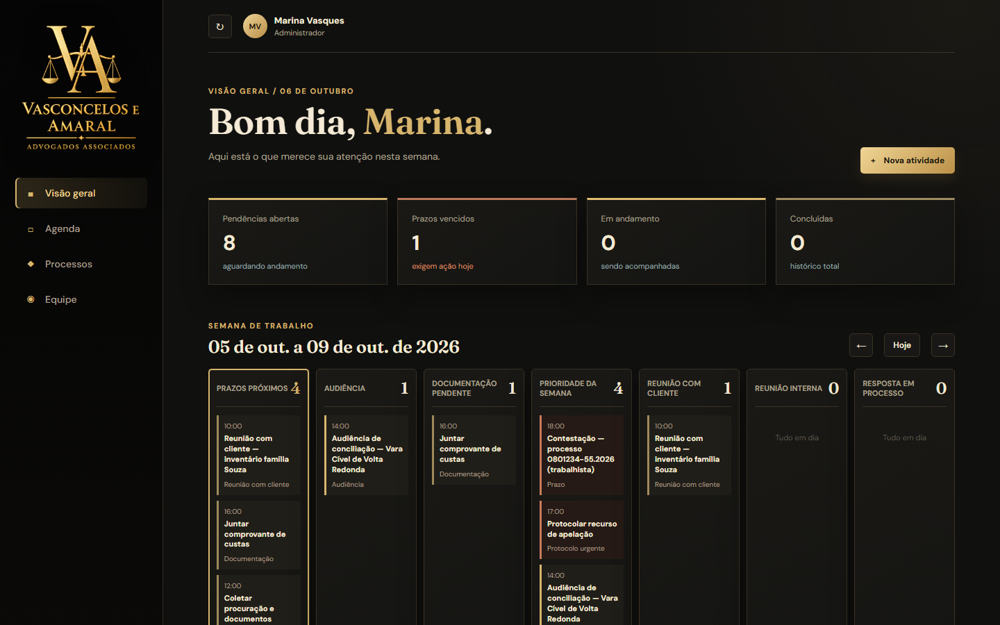
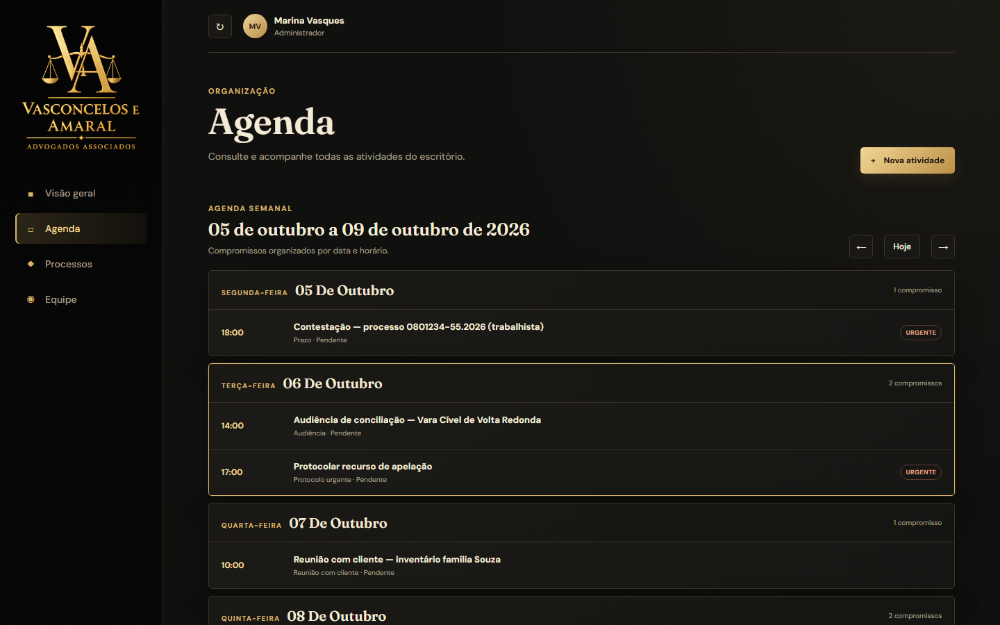
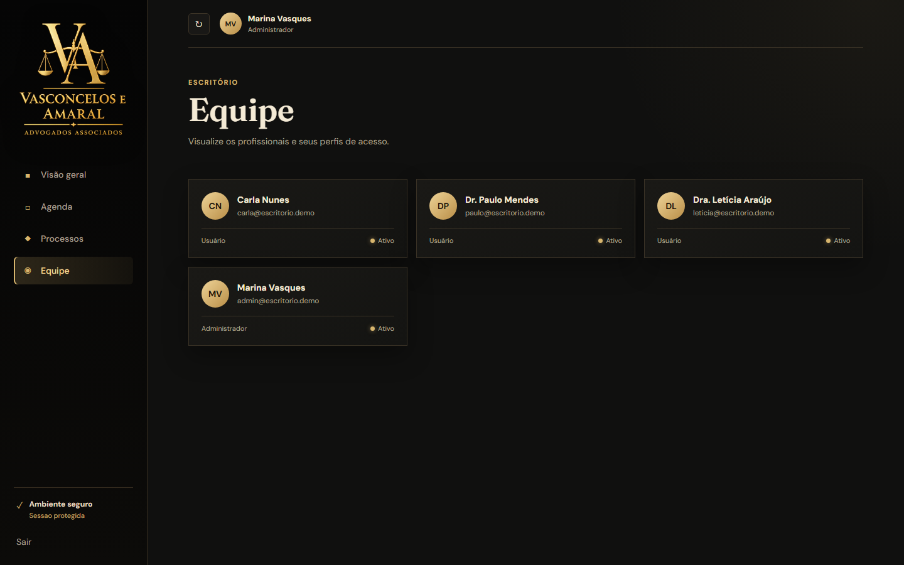
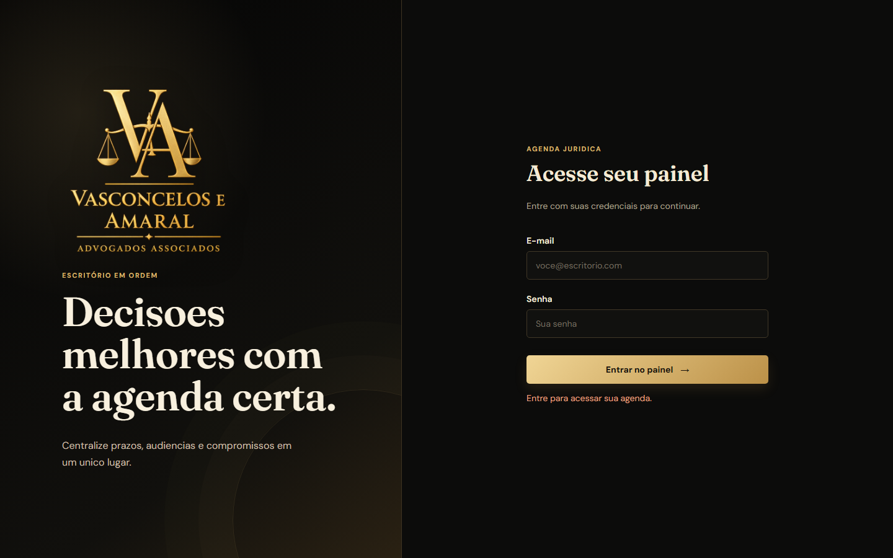
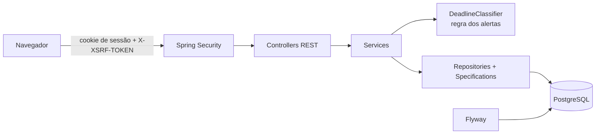

# Agenda Jurídica

**Sistema interno para escritórios de advocacia:** prazos, audiências, protocolos e reuniões organizados na semana, com alertas de vencimento no painel para nenhum prazo processual passar despercebido.

[](https://github.com/Tutzdev/sistema-agenda-juridica/actions/workflows/ci.yml)


> **Projeto freelance real**, desenvolvido para o escritório Vasconcelos e Amaral Advogados Associados. As capturas abaixo usam **dados fictícios**.



## O problema

Num escritório de advocacia, perder um prazo processual pode custar a causa. O controle era feito em planilhas e agendas separadas por advogado, sem uma visão única do que vence hoje, do que já venceu e de quem é o responsável.

## A solução

- **Painel da semana** com pendências abertas, prazos vencidos, em andamento e concluídas.
- Atividades agrupadas por **categoria**: prazos, audiências, documentos pendentes, reuniões com cliente e internas, pendências processuais, protocolos urgentes e levantamento de documentos.
- **Alertas automáticos** calculados a partir da data e hora de vencimento: *vencido*, *vence hoje*, *próximo do vencimento* (janela configurável) e *lembrete ativo*.
- **Responsável** por atividade, prioridade (normal, alta, urgente) e ciclo de vida: pendente → em andamento → concluída, com reabertura e cancelamento.
- **Gestão de equipe** com perfis de administrador e usuário. O sistema impede desativar o último administrador ativo.

| Agenda semanal | Equipe | Login |
| --- | --- | --- |
|  |  |  |

## Arquitetura

Monólito Spring Boot que serve a API REST e a interface (HTML, CSS e JavaScript sem framework) no mesmo domínio. Assim a autenticação usa **sessão com cookie HttpOnly + CSRF**, sem token exposto ao JavaScript.



```text
src/main/java/com/escritorio/agenda_juridica
├── auth/        # login, logout, usuário atual e token CSRF
├── dashboard/   # indicadores, semana de trabalho (WeekCalculator)
├── security/    # configuração de sessão, CSRF, 401/403 em JSON
├── task/        # atividades, classificador de prazos, filtros dinâmicos
├── user/        # equipe, perfis e administrador inicial
└── shared/      # exceções e tratamento global de erros
```

### API

| Recurso | Rotas |
| --- | --- |
| Autenticação | `GET /api/auth/csrf` · `POST /api/auth/login` · `POST /api/auth/logout` · `GET /api/auth/me` |
| Atividades | `GET /api/tasks` (filtros e paginação) · `GET /api/tasks/day` · `GET /api/tasks/week` · `GET /api/tasks/alerts/{alerta}` |
| | `POST /api/tasks` · `PUT /api/tasks/{id}` · `PATCH /api/tasks/{id}/status` · `POST /api/tasks/{id}/complete` · `/reopen` · `/cancel` · `DELETE /api/tasks/{id}` |
| Equipe (admin) | `GET/POST /api/users` · `GET/PUT /api/users/{id}` · `PATCH /api/users/{id}/activation` |
| Painel | `GET /api/dashboard` |

## Decisões técnicas

| Decisão | Por quê |
| --- | --- |
| Sessão + CSRF em vez de JWT | Front e API no mesmo domínio: o cookie `HttpOnly` não fica acessível a scripts, e o `CookieCsrfTokenRepository` protege as escritas. |
| `DeadlineClassifier` isolado | A regra que decide vencido, hoje, próximo ou lembrete fica num lugar só, é usada pelo painel e pelos filtros e é coberta por testes de cada caso. |
| Specifications nos filtros | Período, status, categoria, responsável e alerta combinam sem uma query por combinação. |
| Regras no domínio | Concluir registra `completedAt` e reabrir limpa. Lembrete depois do vencimento é recusado. |
| Erros sem vazamento | `include-stacktrace=never` e `include-message=never`. 401 e 403 respondem em `application/problem+json`. |
| Fuso `America/Sao_Paulo` fixo | Prazo forense é contado no horário de Brasília, independentemente de onde o servidor roda. |

## Como rodar

Pré-requisito: **JDK 21**.

**Modo local (sem instalar banco):** por padrão a aplicação usa H2 em arquivo (`./data`).

```bash
export APP_ADMIN_NAME="Administrador"
export APP_ADMIN_EMAIL=admin@escritorio.local
export APP_ADMIN_PASSWORD=uma-senha-forte

./mvnw spring-boot:run      # http://localhost:8080
```

**Produção (PostgreSQL + Flyway):**

```bash
export DB_URL=jdbc:postgresql://localhost:5432/agenda_juridica
export DB_USERNAME=postgres
export DB_PASSWORD=sua_senha
export DB_DRIVER=org.postgresql.Driver
export FLYWAY_ENABLED=true
export JPA_DDL_AUTO=validate
export SESSION_COOKIE_SECURE=true
```

| Variável | Descrição |
| --- | --- |
| `APP_ADMIN_NAME`, `APP_ADMIN_EMAIL`, `APP_ADMIN_PASSWORD` | Criam (ou redefinem) o administrador na subida. **Sem elas, nenhum administrador é criado**: não existe credencial padrão. |
| `APP_DASHBOARD_UPCOMING_DAYS` | Janela de "próximo do vencimento", padrão 3 dias |
| `SESSION_COOKIE_SECURE` | `true` atrás de HTTPS |

Veja também o [`.env.example`](.env.example).

## Testes

```bash
./mvnw test
```

- **`DeadlineClassifierTest`:** vencido, vence hoje, próximo, lembrete ativo fora da janela, e concluídas ou canceladas sem alerta.
- **`TaskTest` / `TaskRepositoryTest`:** conclusão e reabertura, lembrete inválido, e a consulta do painel com as migrações Flyway aplicadas.
- **`TaskControllerTest` / `DashboardControllerTest`:** validação por campo, 404, 401 sem sessão e criação.
- **`UserControllerSecurityTest` / `UserServiceTest`:** só administrador cria usuário, e-mail duplicado e proteção do último administrador.
- **`InitialAdminInitializerTest`:** nenhum administrador sem credenciais configuradas.
- **`CustomUserDetailsServiceTest` / `WeekCalculatorTest`:** usuário inativo não autentica, e a semana vai de segunda a sexta.

Os testes rodam a cada push no **GitHub Actions**.

## Próximos passos

- Notificação por e-mail dos prazos do dia.
- Vínculo das atividades a processos (número CNJ) com histórico.
- Dockerfile e `docker compose` com PostgreSQL.

---

Desenvolvido por **[Tutzdev](https://github.com/Tutzdev)**.
