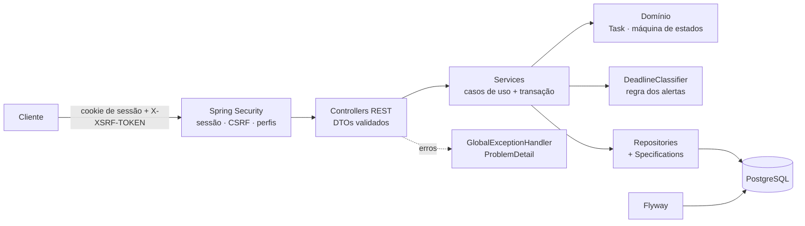

# Agenda Jurídica

**Backend Spring Boot para escritórios de advocacia:** prazos, audiências, protocolos e reuniões organizados na semana, com uma regra de alerta que classifica cada prazo como vencido, vencendo hoje, próximo do vencimento ou com lembrete ativo.

[](https://github.com/Tutzdev/sistema-agenda-juridica/actions/workflows/ci.yml)


> **Projeto freelance real**, feito para o escritório Vasconcelos e Amaral Advogados Associados.

## O problema

Num escritório de advocacia, perder um prazo processual pode custar a causa. O controle era feito em planilhas e agendas separadas por advogado, sem uma visão única do que vence hoje, do que já venceu e de quem é o responsável.

## Destaques de backend

- **Regra de prazo isolada e testada:** `DeadlineClassifier` decide o alerta de cada atividade a partir de um `Clock` injetado, então o teste controla o "hoje".
- **Máquina de estados no domínio:** `Task.changeStatus` só aceita as transições permitidas, num `EnumMap`. Concluir registra `completedAt` e reabrir limpa.
- **Invariantes na entidade:** horário exige data, lembrete exige prazo e lembrete posterior ao prazo é recusado com `BusinessRuleException`.
- **Filtros dinâmicos com Specifications:** período, status, categoria, prioridade, responsável, busca textual e tipo de alerta se combinam sem uma query por combinação.
- **Segurança por sessão:** cookie `HttpOnly` + `CookieCsrfTokenRepository`, rotas de equipe só para `ADMIN`, 401/403 em `application/problem+json`.
- **Erros no padrão RFC 9457:** `@RestControllerAdvice` responde `ProblemDetail` para 400, 404 e 409, sem stack trace nem mensagem interna vazando.
- **Banco versionado:** migrações Flyway (tabelas e índices) e `ddl-auto=validate` em produção.

## Regras de negócio

| Regra | Implementação |
| --- | --- |
| Prazo antes de hoje é **vencido**; no dia, **vence hoje**; dentro da janela configurável, **próximo** | `DeadlineClassifier` + `app.dashboard.upcoming-days` |
| Lembrete ativo só quando a data do lembrete já chegou e o prazo ainda não entrou em alerta | `DeadlineClassifier` |
| Atividade concluída ou cancelada nunca gera alerta | `DeadlineClassifier` |
| Transições de status válidas: pendente → em andamento → concluída, com reabertura e cancelamento | `Task.changeStatus` (`EnumMap` de transições) |
| Só atividade **cancelada** pode ser removida | `TaskService.delete` |
| O último administrador ativo não pode ser desativado nem rebaixado | `UserService` |
| Sem credenciais configuradas, nenhum administrador é criado (não existe senha padrão) | `InitialAdminInitializer` |
| A semana de trabalho vai de segunda a sexta, no fuso `America/Sao_Paulo` | `WeekCalculator` + `Clock` de negócio |

## Arquitetura

Monólito modular por funcionalidade. A API REST e a interface são servidas no mesmo domínio, o que permite autenticar por **sessão com cookie HttpOnly + CSRF**, sem token exposto ao JavaScript.



```text
src/main/java/com/escritorio/agenda_juridica
├── auth/        # login, logout, usuário atual e token CSRF
├── dashboard/   # indicadores e semana de trabalho (WeekCalculator)
├── security/    # sessão, CSRF, perfis, 401/403 em problem+json
├── task/        # atividades, máquina de estados, classificador de prazos, Specifications
├── user/        # equipe, perfis e administrador inicial
└── shared/      # Clock de negócio, exceções e tratamento global de erros
```

### API

| Recurso | Rotas |
| --- | --- |
| Autenticação | `GET /api/auth/csrf` · `POST /api/auth/login` · `POST /api/auth/logout` · `GET /api/auth/me` |
| Atividades | `GET /api/tasks` (filtros e paginação) · `GET /api/tasks/day` · `GET /api/tasks/week` · `GET /api/tasks/alerts/{alerta}` |
| | `POST /api/tasks` · `PUT /api/tasks/{id}` · `PATCH /api/tasks/{id}/status` · `POST /api/tasks/{id}/complete` · `/reopen` · `/cancel` · `DELETE /api/tasks/{id}` |
| Equipe (admin) | `GET/POST /api/users` · `GET/PUT /api/users/{id}` · `PATCH /api/users/{id}/activation` |
| Painel | `GET /api/dashboard?referenceDate=` (totais, vencidas, de hoje, próximas e semana por dia) |

## Decisões técnicas

| Decisão | Por quê |
| --- | --- |
| Sessão + CSRF em vez de JWT | Front e API no mesmo domínio. O cookie `HttpOnly` não fica acessível a scripts e o `CookieCsrfTokenRepository` protege as escritas. |
| `Clock` como bean | O "hoje" é uma dependência. Os testes fixam a data e o classificador não depende do relógio da máquina. |
| Classificador fora da entidade | A mesma regra serve o painel e o filtro `/alerts/{alerta}` e é testada caso a caso. |
| Specifications nos filtros | Cada critério é uma peça pequena. Combinar não exige uma query nova. |
| Pacotes por funcionalidade | `task/` tem controller, service, domínio e DTOs juntos: muda junto, fica junto. |
| `open-in-view=false` | Nada de consulta preguiçosa escapando para a camada web. |
| Erros sem vazamento | `include-stacktrace=never` e `include-message=never`. O cliente recebe `ProblemDetail` com título e detalhe controlados. |
| Fuso `America/Sao_Paulo` fixo | Prazo forense é contado no horário de Brasília, independentemente de onde o servidor roda. |

## Testes

```bash
./mvnw test
```

- **`DeadlineClassifierTest`:** vencido, vence hoje, próximo, lembrete ativo fora da janela, e concluídas ou canceladas sem alerta.
- **`TaskTest` / `TaskRepositoryTest`:** conclusão e reabertura, lembrete inválido, e a consulta do painel com as migrações Flyway aplicadas.
- **`TaskControllerTest` / `DashboardControllerTest`:** validação por campo, 404, 401 sem sessão e criação.
- **`UserControllerSecurityTest` / `UserServiceTest`:** só administrador cria usuário, e-mail duplicado e proteção do último administrador.
- **`InitialAdminInitializerTest`:** nenhum administrador sem credenciais configuradas.
- **`CustomUserDetailsServiceTest` / `WeekCalculatorTest`:** usuário inativo não autentica, e a semana vai de segunda a sexta.

Os testes rodam a cada push no **GitHub Actions**.

## Como rodar

Pré-requisito: **JDK 21**.

**Modo local (sem instalar banco):** por padrão a aplicação usa H2 em arquivo (`./data`).

```bash
export APP_ADMIN_NAME="Administrador"
export APP_ADMIN_EMAIL=admin@escritorio.local
export APP_ADMIN_PASSWORD=uma-senha-forte

./mvnw spring-boot:run      # http://localhost:8080
```

**Produção (PostgreSQL + Flyway):**

```bash
export DB_URL=jdbc:postgresql://localhost:5432/agenda_juridica
export DB_USERNAME=postgres
export DB_PASSWORD=sua_senha
export DB_DRIVER=org.postgresql.Driver
export FLYWAY_ENABLED=true
export JPA_DDL_AUTO=validate
export SESSION_COOKIE_SECURE=true
```

| Variável | Descrição |
| --- | --- |
| `APP_ADMIN_NAME`, `APP_ADMIN_EMAIL`, `APP_ADMIN_PASSWORD` | Criam (ou redefinem) o administrador na subida. **Sem elas, nenhum administrador é criado.** |
| `APP_DASHBOARD_UPCOMING_DAYS` | Janela de "próximo do vencimento", padrão 3 dias |
| `SESSION_COOKIE_SECURE` | `true` atrás de HTTPS |

Veja também o [`.env.example`](.env.example).

## Interface

O próprio Spring serve um painel em HTML, CSS e JavaScript sem framework (`src/main/resources/static`). Ele consome a API acima: visão geral com prazos em alerta, semana por dia, lista filtrável e gestão de equipe.

## Próximos passos

- Notificação por e-mail dos prazos do dia, com rotina agendada.
- Vínculo das atividades a processos (número CNJ) com histórico.
- Dockerfile e `docker compose` com PostgreSQL.

---

Desenvolvido por **[Tutzdev](https://github.com/Tutzdev)**.
